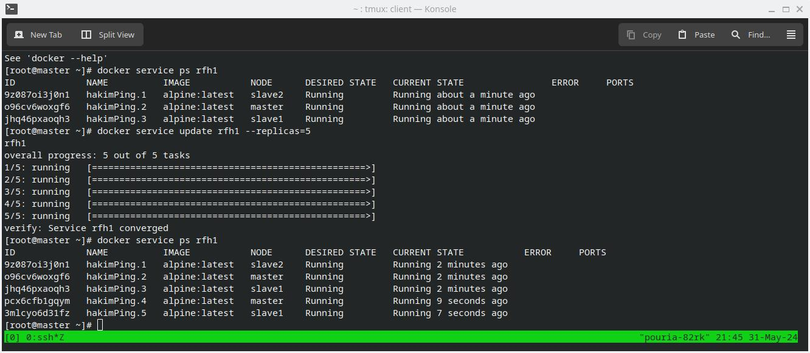
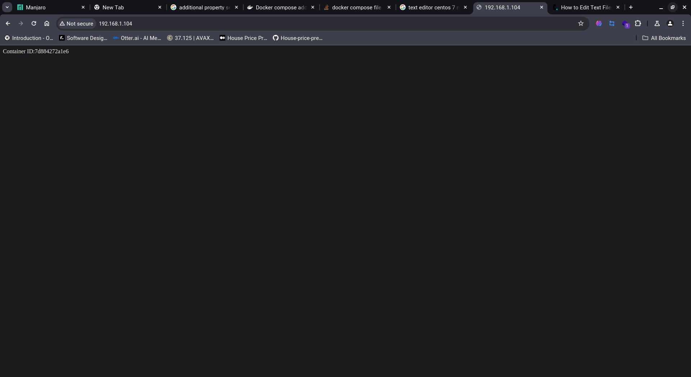

# پیاده‌سازی پروژه لود بالانس(الگوریتم راند رابین) در داکر سوآرم

به منظور پیاده‌سازی پروژه لود بالانس در داکر سوآرم، ما به دستورات زیر نیاز خواهیم داشت:

## 2. **چک کردن وضعیت سوآرم**

 -این دستور برای مشاهده اطلاعات کلی درباره داکر و وضعیت آن استفاده می‌شود:
```bash
docker info
```


- برای بررسی وضعیت فعلی سوآرم و اطمینان از فعال بودن آن، از دستور زیر استفاده می‌کنیم:
```bash
docker info | grep Swarm
```

## 3. **DOCKER SWARM JOIN-TOKEN MANAGER**
- با استفاده از این دستور، یک توکن با دسترسی منیجر برای سوآرم ایجاد می‌کنیم تا نود جدید بتواند به آن متصل شود.
```bash
docker swarm join-token manager
```

- همچنین با استفاده از کلمه worker یک دسترسی نود ورکر ایجاد میکنیم:
```bash
docker swarm join-token worker
```

## 4. **ایجاد یک سرویس با استفاده از توکن منیجر**
- برای ایجاد یک سرویس که روی دو نود پخش شده است، از دستور زیر استفاده می‌کنیم:
```bash
docker service create --name <NAME> --replicas=2 Example:<alpine ping 1.1.1.1>
```

## 5. **بروزرسانی تعداد رپلیکاهای سرویس**
- برای بروزرسانی تعداد رپلیکاهای سرویس بر روی نودها، از دستور زیر استفاده می‌کنیم:
```bash
docker service update <NAME> --replicas=5
```

## 6. **مشاهده لاگ‌های سرویس**
- برای مشاهده لاگ‌های سرویس مورد نظر، از دستور زیر استفاده می‌کنیم:
```bash
docker service logs <NAME>
```

## 7. **ایجاد یک شبکه از نوع Overlay**
- برای ایجاد یک شبکه از نوع Overlay، از دستور زیر استفاده می‌کنیم:
```bash
docker network create --driver overlay mynetwork
```

## 8. **تغییر دسترسی نود به منیجر یا ورکر**
- برای تغییر دسترسی نود مورد نظر به منیجر از پروموت و  تبدیل دسترسی به ورکر از دیموت، استفاده می‌کنیم: 
```bash
docker node promote <NODE_NAME>
docker node demote <NODE_NAME>
```


## 9. DOCKER STACK DEPLOY -C COMPOSER.YML DEPLOYNAME
- با استفاده از این دستور فایل کامپوزرمان را دیپلوی می‌کنیم.
```bash
docker stack deploy -c composer.yml <DEPLOYNAME>
```

## 10. DOCKER STACK LS
- با استفاده از این دستور استک‌هایی که ران می‌شوند و تعداد هر سرویسی که استفاده می‌کنند را می‌توانیم ببینیم.
```bash
docker stack ls
```

این دستورات به شما کمک می‌کنند تا بتوانید پروژه لود بالانس خود را در داکر سوآرم پیاده‌سازی کنید و مدیریت سرویس‌ها و نودهای خود را به بهترین شکل انجام دهید. برای اطلاعات بیشتر و دستورات پیشرفته‌تر، می‌توانید به مستندات رسمی داکر مراجعه کنید.


[](https://github.com/pouria-azad/load-balancing)
[](https://github.com/pouria-azad/load-balancing)
[](https://github.com/pouria-azad/load-balancing)
[](https://github.com/pouria-azad/load-balancing)
[](https://github.com/pouria-azad/load-balancing)
[](https://github.com/pouria-azad/load-balancing)
[](https://github.com/pouria-azad/load-balancing)
[](https://github.com/pouria-azad/load-balancing)
[](https://github.com/pouria-azad/load-balancing)
 - آپدیت‬‫کردن‬ ‫تعداد‬ ‫نود‬ ‫های‬ ‫سرویس‬
#<br>
[](https://github.com/pouria-azad/load-balancing)
- لاگ ها
#<br>
[](https://github.com/pouria-azad/load-balancing)
‫- ابتدا ‬‫یک‬ ‫پوشه‬ ‫با‬ ‫نام‬ ‫دلخواه‬ ‫ایجاد‬ ‫میکنیم‬ ‫تا‬ ‫فایل‬ ‫های‬ ‫استک‬ ‫را‬ ‫آنجا‬
‫قرار‬‫دهیم‬
#<br>
[](https://github.com/pouria-azad/load-balancing)
‫- سپس ‬‫کانفیگ‬ ‫های‬ ‫مورد‬ ‫نظر‬ ‫را‬ ‫انجام‬ ‫میدهیم‬ ‫و‬ ‫با‬ ‫استفاده‬ ‫از‬ ‫دستور‬
  زیر فایل‬ ‫کانفیگ‬ ‫استک‬ ‫را‬ ‫اجرا‬ ‫میکنیم‬
#<br>
[](https://github.com/pouria-azad/load-balancing)
‫- همانطور ‬‫که‬ ‫مشاهده‬ ‫میکنید‬ ‫دو‬ ‫سرویس‬ ‫داریم‬
#<br>
[](https://github.com/pouria-azad/load-balancing)
‫- که ‬‫با‬ ‫دستور‬‬ ‫میتوانیم‬ ‫ببینیم‬ ‫سرویس‬ ‫اپپ‬ ‫در‬ ‫کدام‬ ‫نود‬ ‫ها‬ ‫اجرا‬
‫میشود‬
#<br>
[](https://github.com/pouria-azad/load-balancing)
‫- این هم ‬‫سرویس‬ ‫انجینکس‬
#<br>
[](https://github.com/pouria-azad/load-balancing)
‫- خروجی ‬‫نهایی‬ ‫ما‬ ‫بدین‬ ‫صورت‬ ‫است‬ ‫که‬ ‫با‬ ‫هربار‬ ‫رفرش‬ ‫کرد‬ن‬ ‫آدرس‬
‫یکی از نودها‪،‬‬ ‫متوجه‬ ‫میشویم‬ ‫که‬ ‫سایت‬ ‫ما‬ ‫در‬ ‫نود‬ ‫و‬ ‫کانتینر‬ ‫متفاوتی‬
‫اجرا ‬‫میشود‬ ‫که‬ ‫نام‬ ‫این‬ ‫عمل‬ ‫لود‬ ‫باالنسینگ‬(الگوریتم راند رابین) ‫است‬ ‫‪..‬‬
#<br>
[](https://github.com/pouria-azad/load-balancing)
[](https://github.com/pouria-azad/load-balancing)
[](https://github.com/pouria-azad/load-balancing)
